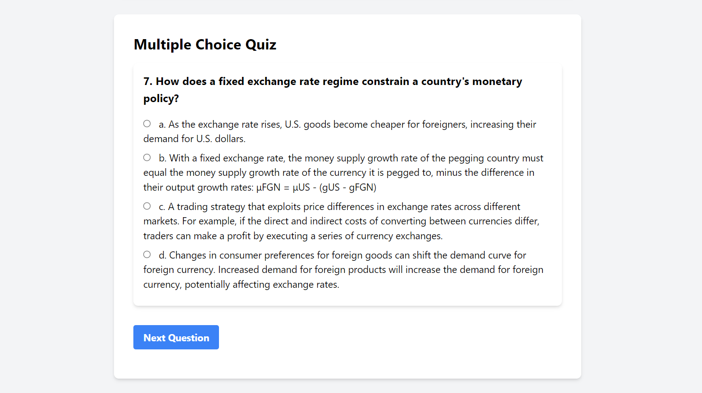

<h1 align="center">ECON333 Exam 2 Revision UI @ UIC</h1>

## *How to use*
Basically I have attatched all of the materials I used to form the UI so don't open them if you want to. The real deal is downloading <b><i>[econ2.html]([url]https://github.com/TUTULEMAN/Econ-333-UIC-Review/blob/main/econ2.html)</i></b> onto your computer and running it locally. I always hated having to lose internet connection mid-way through learning so that's the reason behind that.

## *Contributing*
I really appreciate it if you want to contribute to this project. I can recommend the GitHub issues marked as "Good First Issue" to get started. I'm still trying to build out an even better and accurate question/answer database

## *Notice*
This project is not associated with the school, UIC, in any way. I just enjoy coding and thought that there's no free UI thats similar that could help me test my knowledge for free.

In the upcoming days, I will try to add a function so that I can link the flashcards to the source of the study guide in preparation for the final exam.

## *Visuals*

  <picture>
    <source media="(prefers-color-scheme: dark)" srcset="SS2.png" width="1000">
    
  </picture>
  <picture>
    <source media="(prefers-color-scheme: dark)" srcset="SS1.png" width="1000">
    
  </picture>

